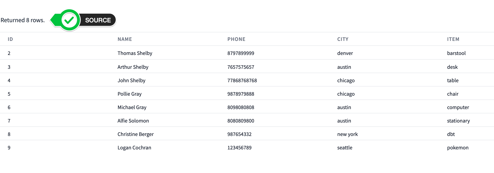

# About this snapshot architecture
This snapshot architecture utilizes native snapshot behavior, but adds a post-hook
so that certain column values within the snapshot can be updated.

### Snapshot Behavior
- Snapshot updates column value vs. adding new record when certain column values update
- The changes to append for need to be implemented with the `check` strategy
- The changes to update for need to be passed into the post-hook macro.
- The updates from the macro are matched on the unique_key specified in the configuration.
- The updates from the macro are only done on `dbt_valid_to is null` (the valid records)

### Setup
1. Grab the macro code for [update_valud_snapshot_records()](https://github.com/christineberger/dbt-demo-snowflake-public/blob/example__snapshot_scenarios/macros/update_valid_snapshot_rows/update_valid_snapshot_records.sql)
   and add it to your `/macros` folder.
2. Create and configure your snapshot. The required configurations for this to work properly
   is outlined below:
     - `unique_key`
     - `strategy='check`'
     - `check_cols` - the list of columns you want to see appended records for
3. Add a `post_hook` to your snapshot configuration that calls the macro you added:
    ```python
        post_hook="{{ update_valid_snapshot_records(
            from_relation=ref('hypothetical_source'), 
            unique_key='id', 
            update_cols=['name']
        ) }}"
    ```
    Parameters:
    - `from_relation` = pass in whichever source or ref you are using the snapshot on.
    - `unique_id` = pass in the name of the unique id column from the source or ref you're using the snapshot on.
    - `update_cols` = list the columns that you'd like to see updated on the snapshot's valid records.
4. Run the snapshot! For what you should expect, see the demo below.

### Demo
1. This is our hypothetical source table (this is likely a table that's already 
   loaded into your warehouse, but for the purposes of this demo we create some 
   data as a model so we can change the "source" easily.)  
     
   Here's what our snapshot looks like when we initially run `dbt snapshot`:    
   
2. Our source data changes. `Thomas Shelby` now goes by `Thomas Bergman`. We 
   should see an update to our valid row for `id=2`.    
     
   After running `dbt snapshot`, the snapshot reflects what we expected - an
   update to `id=2`'s valid record:  
   
3. On our next snapshot, Thomas has moved to `chicago`. We expect to see a new
   record for `id=2` and an update to invalidate the old valid record:  
     
   When we snapshot again, we see that `id=2` has a new valid row and that the 
   old record now has a `dbt_valid_to` date populated:  
   
4. Thomas now goes by "Tom" and has updated this. Our source data changes, and
   we expect that the most recent valid record for `id=2` will update instead
   of appending a new row with the change:  
     
   When we snapshot again, we see that `id=2`'s `dbt_valid_to=null` record
   updated successfully:  
     
